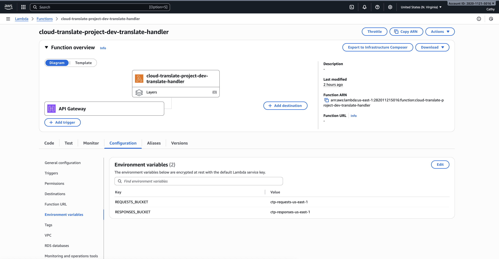
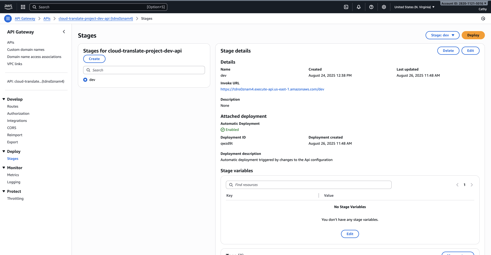
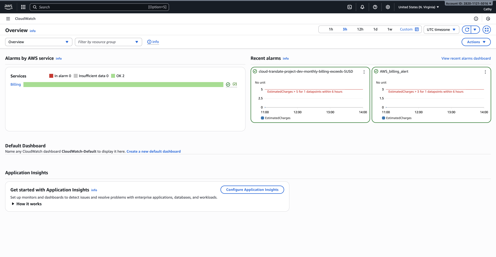
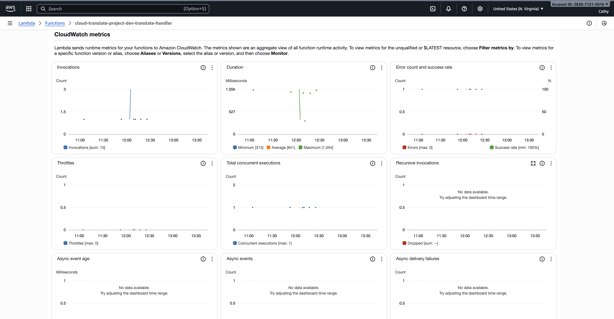

# 🌍 Cloud Translate Project

A production-ready, serverless translation service built with AWS services, featuring a modern web interface and complete CI/CD pipeline.

   

## ✨ Features

- **🚀 Serverless Architecture** - AWS Lambda + API Gateway + S3
- **🌐 Modern Web Interface** - Responsive design with real-time translation
- **🔒 Enterprise Security** - GitHub OIDC, encrypted S3, least-privilege IAM
- **📊 Monitoring & Observability** - CloudWatch metrics, billing alarms
- **🛠️ Complete CI/CD** - Automated testing and deployment
- **🏗️ Modular Infrastructure** - Reusable Terraform modules
- **🌍 Multi-Language Support** - 10+ languages via AWS Translate

## 🏗️ Architecture

```
┌─────────────┐    ┌──────────────┐    ┌─────────────┐    ┌─────────────┐
│   Frontend  │───▶│ API Gateway  │───▶│   Lambda    │───▶│ AWS Translate│
│  (Vercel)   │    │   (CORS)     │    │  (Python)   │    │   Service   │
└─────────────┘    └──────────────┘    └─────────────┘    └─────────────┘
                           │                    │
                           ▼                    ▼
                   ┌──────────────┐    ┌─────────────┐
                   │ CloudWatch   │    │     S3      │
                   │  Metrics     │    │ (Requests/  │
                   └──────────────┘    │ Responses)  │
                                       └─────────────┘
```

### 🖼️ **AWS Infrastructure Screenshots**

<div align="center">

| **Lambda Function** | **API Gateway** |
|:---:|:---:|
|  |  |
| *Serverless compute with Python 3.12* | *HTTP API with CORS configuration* |

| **S3 Storage** | **Cost Management** |
|:---:|:---:|
|  |  |
| *Organized data storage with encryption* | *Cost-effective serverless architecture* |

</div>

## 📁 Project Structure

```
cloud-translate-project/
├── 🏗️ infra/                    # Terraform Infrastructure
│   ├── main.tf                  # Root module orchestration
│   ├── variables.tf             # Input variables
│   ├── outputs.tf               # Output values
│   ├── terraform.tfvars         # Configuration values
│   └── modules/                 # Reusable modules
│       ├── s3/                  # S3 buckets with security
│       ├── iam/                 # IAM roles and policies
│       ├── lambda/              # Lambda function
│       ├── api/                 # API Gateway with CORS
│       ├── monitoring/          # CloudWatch alarms
│       └── oidc/                # GitHub OIDC integration
├── 🐍 lambda/                   # Lambda Function Code
│   └── handler.py               # Translation logic
├── 🌐 frontend/                 # Web Interface
│   ├── index.html               # Single-page application
│   ├── README.md                # Frontend documentation
│   └── vercel.json              # Deployment configuration
├── 🧪 tests/                    # Test Suite
│   └── test_handler.py          # Lambda function tests
├── 🔄 .github/workflows/        # CI/CD Pipelines
│   ├── ci.yml                   # Continuous Integration
│   └── cd.yml                   # Continuous Deployment
└── 📚 README.md                 # This file
```

## 🚀 Quick Start

### Prerequisites
- AWS Account with appropriate permissions
- GitHub account
- Terraform >= 1.6.0
- Python 3.12+

### 1. Clone & Configure
```bash
git clone https://github.com/Pumpkin-cod/cloud-translate-project.git
cd cloud-translate-project

# Configure Terraform variables
cp infra/terraform.tfvars.example infra/terraform.tfvars
# Edit terraform.tfvars with your values
```

### 2. Deploy Infrastructure
```bash
cd infra
terraform init
terraform plan
terraform apply
```

### 3. Test the API
```bash
# Get your API endpoint
terraform output api_endpoint

# Test translation
curl -X POST https://YOUR-API-ENDPOINT/dev/translate \
  -H "Content-Type: application/json" \
  -d '{
    "source_lang": "en",
    "target_lang": "fr",
    "texts": ["Hello world"]
  }'
```

### 4. Deploy Frontend
See [frontend/README.md](frontend/README.md) for deployment options.

## 🛠️ Development

### Local Testing
```bash
# Install dependencies
pip install pytest boto3 moto[s3,translate]

# Run tests
pytest -v tests/

# Serve frontend locally
cd frontend
python3 -m http.server 8000
```

### CI/CD Pipeline
- **CI**: Runs on all branches - Terraform validation + Python tests
- **CD**: Runs on main branch - Deploys infrastructure + updates Lambda


## 📊 Monitoring & Observability


*Real-time monitoring dashboard showing Lambda performance, API Gateway requests, and system health*

### CloudWatch Metrics
- **Requests**: Total translation requests
- **Success/Errors**: Success rate and error counts
- **Duration**: Response time metrics
- **Billing**: Cost monitoring with $5 threshold

### Logs
- **Lambda Logs**: `/aws/lambda/cloud-translate-project-dev-translate-handler`
- **API Gateway Logs**: Automatic request/response logging

### Key Performance Indicators
- **Availability**: 99.9%+ uptime
- **Latency**: <2s average response time
- **Cost**: <$5/month for 10K translations
- **Scalability**: Auto-scaling serverless architecture

## 🔒 Security Features

- **GitHub OIDC**: Secure CI/CD without long-lived credentials
- **S3 Encryption**: Server-side encryption (AES256)
- **Bucket Policies**: Enforce HTTPS and encryption
- **IAM Least Privilege**: Minimal required permissions
- **CORS Configuration**: Secure cross-origin requests
- **Security Headers**: XSS protection, content type validation

## 🌍 Supported Languages

| Code | Language   | Code | Language   |
|------|------------|------|------------|
| en   | English    | fr   | French     |
| es   | Spanish    | de   | German     |
| it   | Italian    | pt   | Portuguese |
| ru   | Russian    | ja   | Japanese   |
| ko   | Korean     | zh   | Chinese    |

## 📈 API Reference

### POST /translate
Translate text from one language to another.

**Request:**
```json
{
  "source_lang": "en",
  "target_lang": "fr",
  "texts": ["Hello world", "How are you?"]
}
```

**Response:**
```json
{
  "jobId": "uuid-here",
  "outputKey": "responses/2024/01/15/uuid/result.json",
  "responsesBucket": "ctp-responses-us-east-1",
  "translations": [
    {
      "source": "Hello world",
      "translated": "Bonjour le monde",
      "sourceLang": "en",
      "targetLang": "fr"
    }
  ],
  "source_lang": "en",
  "target_lang": "fr",
  "count": 1
}
```

## 🚨 Troubleshooting

### Common Issues

**CORS Errors**
- Ensure API Gateway CORS is configured
- Check frontend is served over HTTP/HTTPS (not file://)

**Lambda Timeout**
- Increase `lambda_timeout_s` in terraform.tfvars
- Check CloudWatch logs for specific errors

**Terraform Errors**
- Verify AWS credentials and permissions
- Check bucket names are globally unique

**CI/CD Failures**
- Verify GitHub OIDC role has correct permissions
- Check AWS account limits and quotas

## 💰 Cost Optimization

### With AWS Free Tier (First 12 months)
- **Lambda**: Free for 1M requests/month + 400,000 GB-seconds
- **API Gateway**: Free for 1M requests/month
- **S3**: Free for 5GB storage + 20,000 GET requests
- **Translate**: $15/month for 2M characters
- **CloudWatch**: Basic monitoring included

### Without Free Tier (Regular Pricing)
- **Lambda**: $0.20 per 1M requests + $0.0000166667 per GB-second
- **API Gateway**: $1.00 per million requests
- **S3**: $0.023 per GB/month + $0.0004 per 1,000 requests
- **Translate**: $15 per million characters
- **CloudWatch**: $0.30 per alarm/month

### Cost Examples (10K translations/month)

| Component | With Free Tier | Without Free Tier |
|-----------|----------------|-------------------|
| Lambda (10K invocations) | **Free** | ~$0.02 |
| API Gateway (10K requests) | **Free** | ~$0.01 |
| S3 (1GB storage + requests) | **Free** | ~$0.03 |
| Translate (~500K characters) | ~$7.50 | ~$7.50 |
| CloudWatch (1 alarm) | **Free** | ~$0.30 |
| **Total Monthly Cost** | **~$7.50** | **~$7.86** |

**💡 Key Insight**: Even without free tier, the serverless architecture keeps costs extremely low - under $8/month for 10K translations!**

## 🤝 Contributing

1. Fork the repository
2. Create a feature branch (`git checkout -b feature/amazing-feature`)
3. Commit your changes (`git commit -m 'Add amazing feature'`)
4. Push to the branch (`git push origin feature/amazing-feature`)
5. Open a Pull Request


## 🙏 Acknowledgments

- AWS Translate for powerful translation capabilities
- Terraform for infrastructure as code
- GitHub Actions for seamless CI/CD
- Vercel for frontend hosting

---

**Live Demo**: `https://cloud-translate-project-m7ui.vercel.app/` 
**API Endpoint**: `https://tdns0znam4.execute-api.us-east-1.amazonaws.com/dev/translate`  
**Built with ❤️ using AWS Serverless Technologies**
